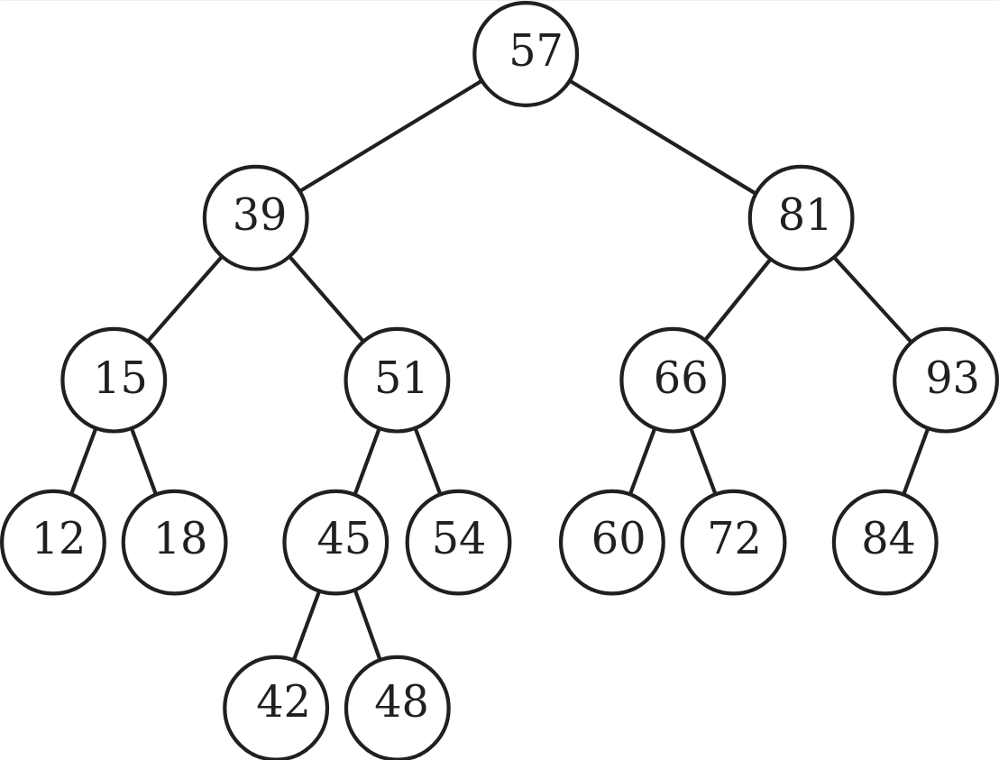

This exam was given as an open-book online exam.
The questions thus differ from a typical in-person exam.

## Personalized exam

The exam was personalized based on the personnummer of the student.
Here are example instances for personnummer 000000000000.

### Question 3

23, 90, 78, 50, 31, 83, 12, 99

### Question 4

A:11, D:9, F:10, E:7, B:8, C:10

### Question 5

2, 4, 8, 9, 11, 13, 14, 16, 19, 22, 27, 28

### Question 6

### Question 8

21, 63, 69, 82, 10, 62, 49, 27
