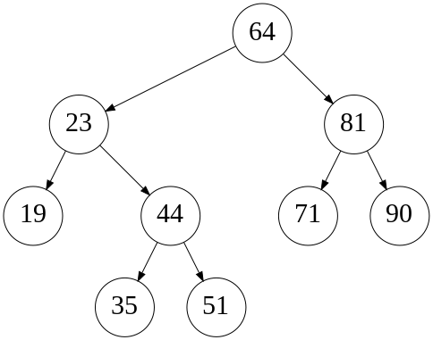

This exam was given as an open-book online exam.
The questions thus differ from a typical in-person exam.

## Personalized exam

The exam was personalized based on the personnummer of the student.
Here are example instances for personnummer 000000000000.

### Question 1

**Algorithm**:

```
boolean prog(int[] cs):
    bs = new dynamic array of int
    for i in 0 .. cs.length-1:
        for j in 0 .. i:
            bs.add(cs[j] + cs[i])

    boolean r = false;
    for u in bs:
        for v in bs:
            if u + v == 0:
                r = true;
    return r;
```

**Part B question**:

When you run the program on your computer in 2021 on an array of size 1000, it takes one day.
Your computer has gotten faster by a factor of 2 every 5 years.
What is the largest array size you could have processed in one day in 1961?

### Question 2

Array: {21, 36, 82, 97, 76, 44, 10, 61, 57}

### Question 3



**If you have trouble scanning your answers**, you can instead write your tree as a nested list. For example, you could write the tree above as:

* 64
  - 23
    + 19
    + 44
      * 35
      * 51
  - 81
    + 71
    + 90

If you choose to do this, if a node has one child you should say if it's the left or right child.

### Question 4

Here is a partial implementation of the algorithm:

```
List<Int> mergePQs(PriorityQueue<Int> pq1, PriorityQueue<Int> pq2):
    List<Int> result = new DynamicArrayList<Int>()
    while not (pq1.isEmpty() and pq2.isEmpty()):
        ???
    return result
```

### Question 5

**Hash table array**:

    [P, S, -, V, Q, T, -, R, U]

or, equivalently:

* 0: P
* 1: S
* 2: -
* 3: V
* 4: Q
* 5: T
* 6: -
* 7: R
* 8: U

**Hash values**:

    hash(P) = 18
    hash(Q) = 4
    hash(R) = 7
    hash(S) = 8
    hash(T) = 12
    hash(U) = 16
    hash(V) = 3

### Question 6

Edge weights:

* QT:12, QX:11, PT:6, PX:7, PS:5, PZ:3, SX:1, SZ:4, RZ:10, RU:9, RY:13, UY:8

or equivalently, inserted into the graph:

    Q -- 11 -- X --- 1 --- S           R --- 13 --- Y
     \          \         / \         / \         /
      \          \       /   \       /   \       /
      12          7     5     4    10     9     8
        \          \   /       \   /       \   /
         \          \ /         \ /         \ /
          T -- 6 --- P --- 3 --- Z           U

## Question 7

* A(n, k) = O((n + 12 sqrt(n)) (1 + 12 sqrt(k))).

* B(n, k) is the complexity of the below algorithm for `bs` of size `n` and `i` equal to `0`:

        boolean has_sum(int[] bs, int i, int y):
        if i == bs.length: return y == 0
            return has_sum(bs, i + 1, y) or has_sum(bs, i + 1, y - bs[i])

* C(n, k) is the complexity of binary search on a sorted array of size `n k`.

* D(n, k) = O((n + n k + k)^12).

* E(n, k) is the complexity of the below algorithm for `set` of size `n` and `xs` of size `k`:

        void track_large(RedBlackSet<Int> set, int[] xs):
            for x in xs:
                set.add(x)
                set.remove(set.min())
