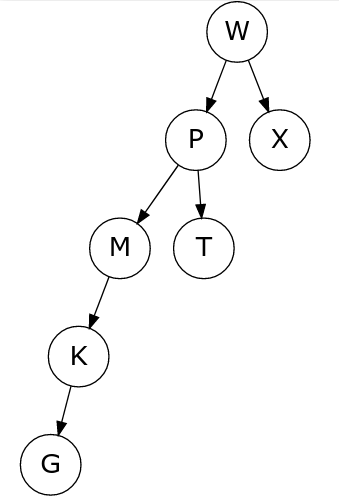
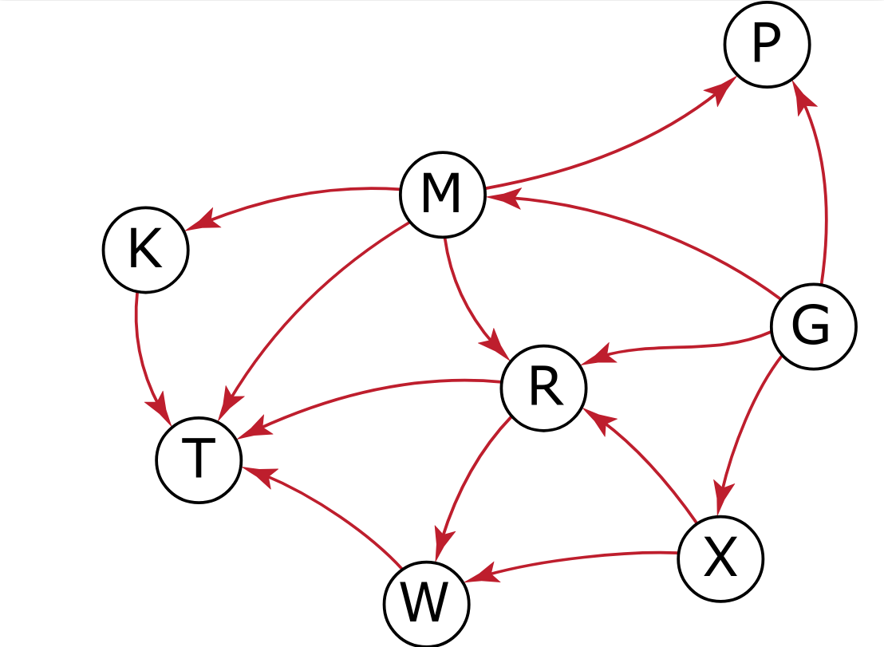

This exam was given as an open-book online exam.
The questions thus differ from a typical in-person exam.

## Personalized exam

The exam was also personalized based on the personnummer of the student.
Here are example instances for personnummer 000000000000.

### Question 2

* 18
* 84
* 58
* 44
* 73
* 89
* 60
* 29
* 10
* 21

### Question 3

Insättningsordning: 5 0 2 1 4 4 6

* a) 5 0 1 2 4 4 6
* b) 0 1 4 2 4 5 6
* c) 0 4 1 2 5 4 6

### Question 4

17

### Question 5

### Question 6

* 91
* 31
* 85
* 89
* 86
* 72

### Question 9

